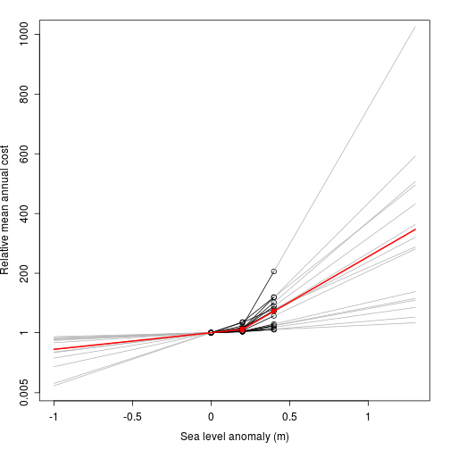
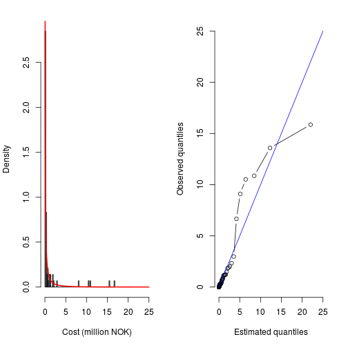
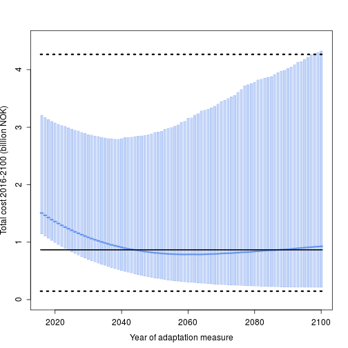

## Optimal timing of sea level rise adaptation measures in Bergen, Norway
### Author: Thordis L. Thorarinsdottir
    
Data files are located in the folder "data".
R working directory should be set to current directory.

To run the analysis, run the main script BergenDamageData.R as shown below. 


```r
rm(list=ls())

library(actuar)
library(RgoogleMaps)
source("getDamageData.R")
source("fitBurrDist.R")
source("getDamageMult.R")
source("getHallegatteData.R")
source("getChangeSlopes.R")
source("getDamageTrajectories.R")
source("getDiscountRate.R")
source("getAdaptationCost.R")
source("getUncertaintyTrajectories.R")
source("plotFigure1.R")
source("plotFigure2.R")
source("plotFigure3.R")
source("plotFigure4.R")
source("plotFigure5.R")
```

Read in yearly damage data (in MNOK) from Rogaland and Hordaland 1980 to 2015.

```r
sf.damage <- getDamageData()
round(sf.damage, 3)
```

```
##  [1]  0.000  0.026  0.001  0.000  0.013  0.000  0.022  0.084  0.478  1.428
## [11]  9.013  0.715  0.385  2.886  3.135  0.392  0.110  0.321  0.241  2.167
## [21]  1.125  0.188  1.047  0.178  0.179 43.824  0.142  3.907  0.699  1.441
## [31]  0.032 11.944  1.446  8.985  2.385 65.611  0.051  0.376  0.027  0.025
## [41]  0.066  0.000  0.000  3.616  0.250  0.127  1.523  0.070  0.045  1.679
## [51]  5.106  0.005  0.018  0.029  0.019  1.917 11.082  0.446  0.108  0.000
## [61]  0.708 32.122  0.189  1.840  1.431  0.118  0.000 12.620  1.067  5.902
## [71]  2.453 44.129
```
Get normalized data from Hallegatte et al. (2013) on relation between change in damage cost and sea level.  

```r
E <- getHallegatteData()
E
```

```
##          City MeanCurrentLoss Mean20cmLoss Mean40cmLoss
## 1   Amsterdam               1     6.222222     11.33333
## 2      Athens               1    18.000000     73.00000
## 3   Barcelona               1    12.333333    102.33333
## 4      Dublin               1    12.142857     76.00000
## 5     Glasgow               1    23.750000    206.00000
## 6     Hamburg               1     4.357143     19.14286
## 7    Helsinki               1     3.666667     12.66667
## 8      Napoli               1    35.000000     81.00000
## 9  Copenhagen               1     5.142857     25.28571
## 10     Lisbon               1     7.692308     57.46154
## 11     London               1     5.000000     24.07692
## 12      Porto               1     5.666667     29.83333
## 13  Rotterdam               1    36.571429    120.00000
## 14  Marseille               1    14.333333    119.33333
## 15  Stockholm               1    14.000000     90.00000
```
Extrapolate to any sea level rise. 

```r
slopes <- getChangeSlopes(E)
slopes
```

```
## $low
##  [1] 0.2611111 0.8500000 0.5666667 0.5571429 1.1375000 0.1678571 0.1333333
##  [8] 1.7000000 0.2071429 0.3346154 0.2000000 0.2333333 1.7785714 0.6666667
## [15] 0.6500000
## 
## $high
##  [1] 0.2555556 2.7500000 4.5000000 3.1928571 9.1125000 0.7392857 0.4500000
##  [8] 2.3000000 1.0071429 2.4884615 0.9538462 1.2083333 4.1714286 5.2500000
## [15] 3.8000000
```
Plot changes in damages as a function of sea level rise with data from Hallegatte et al. (2013) indicated by black circles and the median change indicated with a red line. 

```r
plotFigure2(E, ifPdf=FALSE)
```



Fit Burr distribution to damage data.   

```r
par.est.res <- fitBurrDist(sf.damage, E)   
par.est <- par.est.res$par ## parameter estimates
round(par.est, 3)
```

```
## [1] 3.936 0.457 0.260
```

```r
mult <- par.est.res$mult ## multiplicative damage data corrections
round(mult, 3)
```

```
##  [1] 1.125 2.050 3.008 0.338 0.457 0.351 2.556 3.951 4.791 6.529 0.539
## [12] 2.714 2.149 2.502 4.170 0.323 2.895 4.744 5.130 5.054 5.295 6.099
## [23] 3.472 5.107 4.853 4.009 8.035 7.822 5.372 4.351 5.870 6.619 4.400
## [34] 7.767 7.420 4.229 1.125 2.050 3.008 0.338 0.457 0.351 2.556 3.951
## [45] 4.791 6.529 0.539 2.714 2.149 2.502 4.170 0.323 2.895 4.744 5.130
## [56] 5.054 5.295 6.099 3.472 5.107 4.853 4.009 8.035 7.822 5.372 4.351
## [67] 5.870 6.619 4.400 7.767 7.420 4.229
```

Plot histogram of damage data and estimated Burr distribution. 

```r
plotFigure1(sf.damage/mult, par.est, ifPdf=FALSE)
```



Get adaptation cost for the construction of two inner barriers from Grief Foundation (2009) (in MNOK at 2015 level).   

```r
adaptation.cost <- getAdaptationCost() 
adaptation.cost
```

```
## [1] 1112
```

Create damage distributions for 2016-2100 under various scenarios. 

```r
## res26 <- getDamageTrajectories(E, par.est, slopes, adaptation.cost, inputfile="data/Simulation_2_6.Rdata") 
## save(res26, file="data/calculatedDamage_nonstat26.RData")
## res45 <- getDamageTrajectories(E, par.est, slopes, adaptation.cost, inputfile="data/Simulation_4_5.Rdata") 
## save(res45, file="data/calculatedDamage_nonstat45.RData")
## res <- getDamageTrajectories(E, par.est, slopes, adaptation.cost, inputfile="data/Simulation_8_5.Rdata") 
## save(res, file="data/calculatedDamage_nonstat.RData")
load("data/calculatedDamage_nonstat.RData")
load("data/calculatedDamage_nonstat26.RData")
load("data/calculatedDamage_nonstat45.RData")
```

Create plot that compares accumulated damage costs under various scenarios: Median projected cumulative damage costs under constant sea level (blue line), under sea level rise according to RCP 8.5 with no adaptation (black line) and with adaptation finished in 2047 (red line). The blue shaded area denotes the 90% projection interval under constant sea level.  Dotted lines indicate 90% projection intervals with sea level rise according to RCP 8.5.   

```r
plotFigure3(res, ifPdf=FALSE) 
```


Plot comparing total damage cost 2016-2100 under different adaptation timings, showing median total costs (blue lines) and 90% projection intervals. Median projected total damage under no adaptation is indicated with a black line and the associated 90% projection interval with black dotted lines. 

```r
plotFigure4(res, ifPdf=FALSE) 
```



Investigation of the effects of uncertainty (no adaptation).

```r
res.unc <- getUncertaintyTrajectories(E=E,
                                      slopes=slopes,
                                      orig.damage=res$orig,
                                      damage.scenario=res$scenario,
                                      inputfile="data/Simulation_8_5.Rdata")
total.damage <- apply(res$yearly, 1, sum)
summary(total.damage)
```

```
##     Min.  1st Qu.   Median     Mean  3rd Qu.     Max. 
##    36.57   370.60   866.50  1422.00  1702.00 47190.00
```

```r
res.unc26 <- getUncertaintyTrajectories(E=E,
                                        slopes=slopes,
                                        orig.damage=res26$orig,
                                        damage.scenario=res26$scenario,
                                        inputfile="data/Simulation_2_6.Rdata")
total.damage26 <- apply(res26$yearly, 1, sum)
summary(total.damage26)
```

```
##     Min.  1st Qu.   Median     Mean  3rd Qu.     Max. 
##    22.84   156.20   351.00   664.40   765.20 64230.00
```

```r
res.unc45 <- getUncertaintyTrajectories(E=E,
                                        slopes=slopes,
                                        orig.damage=res45$orig,
                                        damage.scenario=res45$scenario,
                                        inputfile="data/Simulation_4_5.Rdata")
total.damage45 <- apply(res45$yearly, 1, sum)
summary(total.damage45)
```

```
##    Min. 1st Qu.  Median    Mean 3rd Qu.    Max. 
##    26.8   206.0   456.4   813.7   940.3 63670.0
```

Plot comparing distributions of total damage for various uncertainty settings.

```r
plotFigure5(res.unc, total.damage, res.unc45, total.damage45, res.unc26, total.damage26, ifPdf=FALSE, fileName="figures/UncertaintyLog.pdf")
```


